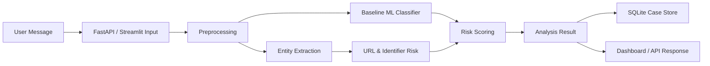
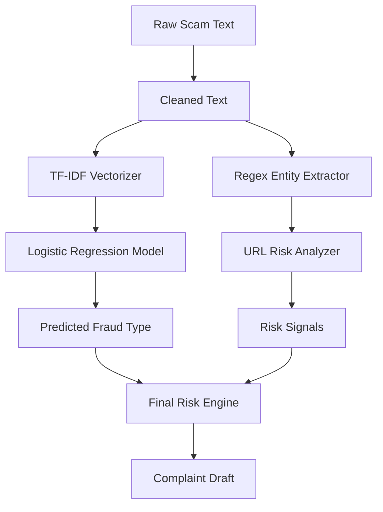

# COVER PAGE

**Project Title:** FraudLens Bharat: AI-Based Hinglish Cyber-Fraud Detection and Complaint Triage System  
**Student Name(s) & Roll Number(s):** To be filled  
**Program:** BSc Computer Science (Online Mode)  
**Institution Name:** To be filled  
**Academic Year:** 2025-2026  
**Internal Supervisor Name:** To be filled  

## Declaration

I hereby declare that this capstone project titled "FraudLens Bharat: AI-Based Hinglish Cyber-Fraud Detection and Complaint Triage System" is an original work carried out by me/us and has not been submitted to any other university or institution for the award of any degree.

## Abstract

Cyber-fraud reporting in India often begins with unstructured evidence such as SMS messages, WhatsApp chats, payment screenshots, suspicious links, phone numbers, and UPI IDs. Many victims describe incidents in Hinglish or mixed Hindi-English language, which makes direct use of standard English-only fraud detection tools less reliable. FraudLens Bharat is a Phase 1 prototype that demonstrates how natural language processing, rule-based entity extraction, URL risk analysis, and explainable scoring can support early cyber-fraud triage. The system accepts pasted scam text, classifies it into one of eight fraud categories, extracts important evidence, identifies risky URLs or payment indicators, assigns a low/medium/high risk level, and generates a complaint-ready incident summary for manual use. The implementation uses a TF-IDF and Logistic Regression baseline classifier, regex-based evidence extraction, SQLite storage, FastAPI endpoints, and a Streamlit dashboard. Phase 1 focuses on a stable baseline system that can be evaluated with test cases, precision/recall/F1 metrics, latency, and reproducible demo scenarios. Future phases will extend the system with OCR-based screenshot analysis, transformer-based classification, and graph analytics for repeated fraud identifiers.

# Table of Contents

1. Introduction  
2. Implementation Details  
3. Testing, Validation & Results  
4. Execution / Deployment Details  
5. Project Execution Evidence  
6. Conclusion & Future Work  
References  
Appendix  

# List of Figures

| Figure No. | Title |
|---|---|
| Fig. 1 | High-Level System Architecture |
| Fig. 2 | Data Flow Diagram |
| Fig. 3 | Module Interaction Diagram |
| Fig. 4 | Confusion Matrix |
| Fig. 5 | Dashboard Analysis Result |

# List of Tables

| Table No. | Title |
|---|---|
| Table 1 | Fraud Class Taxonomy |
| Table 2 | Technology Stack |
| Table 3 | Test Cases |
| Table 4 | Phase 1 Result Metrics |
| Table 5 | Weekly Progress Summary |

# CHAPTER 1: INTRODUCTION

## 1.1 Overview of the Project

FraudLens Bharat is a software prototype for cyber-fraud triage in India. It focuses on scam messages written in English, Hindi, and Hinglish. The system analyzes suspicious text, predicts the scam category, extracts evidence, scores risk, and creates a structured complaint summary.

## 1.2 Problem Statement & Motivation

Cyber-fraud victims often have scattered and incomplete evidence. A user may receive a fake KYC link, an OTP request, a digital arrest threat, a fake job message, or a UPI refund request. When this evidence is reported manually, important identifiers such as phone numbers, UPI IDs, URLs, amounts, or threat phrases may be missed. Hinglish and mixed-language text creates an additional challenge because many generic models are trained primarily on clean English text.

## 1.3 Objectives of the Capstone

- Build a baseline fraud message classifier.
- Extract key evidence entities from suspicious text.
- Detect risky URL and identifier patterns.
- Generate explainable low/medium/high risk levels.
- Store analyzed cases locally.
- Provide a simple dashboard and API for demonstration.
- Evaluate the system using metrics and documented test cases.

## 1.4 Scope of Implementation

Phase 1 includes pasted text analysis only. It does not include screenshot OCR, transformer fine-tuning, graph analytics, real-time government integration, or automatic complaint submission. These are reserved for Phase 2.

## 1.5 Organization of the Report

Chapter 2 explains architecture and implementation. Chapter 3 covers testing and results. Chapter 4 covers execution steps and deployment details. Chapter 5 records project evidence. Chapter 6 concludes the work and lists future enhancements.

# CHAPTER 2: IMPLEMENTATION DETAILS

## 2.1 System Architecture & Design



## 2.2 Data Flow Diagram



## 2.3 Technology Stack

| Layer | Technology |
|---|---|
| Language | Python |
| API | FastAPI, Uvicorn |
| Dashboard | Streamlit |
| ML | scikit-learn, TF-IDF, Logistic Regression |
| Storage | SQLite |
| Testing | pytest |
| Metrics | scikit-learn, matplotlib, seaborn |
| Future Phase | OCR, transformers, NetworkX |

## 2.4 System Modules

- **Preprocessing:** Cleans whitespace, lowercases text, and preserves URLs, phone numbers, UPI IDs, and fraud tokens.
- **Entity Extraction:** Extracts phone numbers, UPI IDs, URLs, emails, money amounts, OTP-like codes, urgency phrases, and threat phrases.
- **URL Risk:** Flags shorteners, non-HTTPS links, IP-based URLs, and suspicious fraud keywords.
- **Model Training:** Trains a keyword-enriched TF-IDF + Logistic Regression baseline classifier.
- **Model Inference:** Predicts fraud category and confidence; falls back to rule-based classification if model files are unavailable.
- **Risk Scoring:** Combines classifier confidence, risky entities, URL signals, and urgency/threat signals.
- **API:** Provides health, analyze, and case-history endpoints.
- **Dashboard:** Provides the user-facing Phase 1 demo interface.

## 2.5 Key Algorithms / Logic

```text
Input: suspicious message text
1. Normalize and clean text.
2. Extract evidence entities using regex and keyword lists.
3. Predict scam category using baseline ML model.
4. Analyze URLs for shorteners, non-HTTPS, suspicious keywords, and IP hostnames.
5. Combine model confidence and risk signals.
6. Assign low, medium, or high risk level.
7. Generate explanation and complaint summary.
8. Store case and return result.
```

## 2.6 Screenshots / Code Snippets

Screenshots to be added after local execution:

- Dashboard home screen
- Scam analysis result
- Extracted entities table
- API docs page
- Confusion matrix
- Test result terminal

# CHAPTER 3: TESTING, VALIDATION & RESULTS

## 3.1 Test Plan

Testing includes unit tests, API tests, model evaluation, and manual dashboard validation.

## 3.2 Test Cases

Refer to `docs/test_cases.md`.

## 3.3 Results & Analysis

Phase 1 metrics are generated by `python -m fraudlens.model_training` and stored in:

- `models/metrics.json`
- `outputs/metrics/classification_report.txt`
- `outputs/metrics/confusion_matrix.png`

# CHAPTER 4: EXECUTION / DEPLOYMENT DETAILS

## Execution Environment

- Python 3.9+
- Local virtual environment
- SQLite local database

## Deployment Steps

```bash
python3 -m venv .venv
source .venv/bin/activate
pip install -r requirements.txt
pip install -e .
python -m fraudlens.model_training
uvicorn fraudlens.api:app --reload
streamlit run src/fraudlens/dashboard.py
pytest
```

## Demo Screenshots

To be added in `outputs/screenshots/`.

## Demo Video Link

To be added after recording final Phase 1 demo.

# CHAPTER 5: PROJECT EXECUTION EVIDENCE

## 5.1 Version Control Evidence

- GitHub repository link: https://github.com/GautamBytes/fraudlens-bharat-phase-1
- Commit history screenshot: To be added

## 5.2 Weekly Progress Summary

Refer to `docs/weekly_progress.md`.

## 5.3 Supervisor Interaction Summary

Refer to `docs/supervisor_interaction.md`.

# CHAPTER 6: CONCLUSION & FUTURE WORK

## Summary of Implementation

Phase 1 implements a complete text-based baseline cyber-fraud triage prototype. It can classify scam text, extract evidence, detect URL risk, generate explanations, and store case history.

## Achievements

- Built a working baseline classifier.
- Implemented practical entity extraction.
- Added explainable risk scoring.
- Created API and dashboard interfaces.
- Added test cases and metrics generation.

## Limitations

- Dataset is synthetic and limited.
- OCR is not included in Phase 1.
- Transformer models are not included in Phase 1.
- No automatic government portal integration is performed.

## Future Enhancements

- Screenshot OCR and manual correction workflow.
- Transformer-based Hinglish classifier.
- Fraud entity graph using NetworkX.
- Stronger phishing URL dataset and model.
- Multilingual extension beyond Hindi/Hinglish/English.

# REFERENCES

Refer to `docs/references.md`.

# APPENDIX

A. User Manual: `docs/user_manual.md`  
B. Installation Guide: `docs/installation_guide.md`  
C. Source Code Link: https://github.com/GautamBytes/fraudlens-bharat-phase-1  
D. Demo Video Link: To be added after recording  
