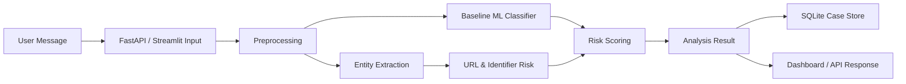
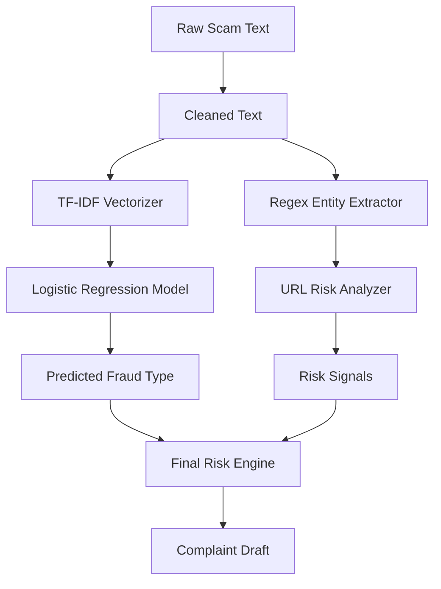

# COVER PAGE

**Project Title:** FraudLens Bharat: AI-Based Hinglish Cyber-Fraud Detection and Complaint Triage System  
**Student Name:** Gautam Manchandani  
**Student ID:** 2023EBCS209  
**Program:** BSc Computer Science (Online Mode)  
**Institution Name:** BITS Pilani  
**Academic Year:** 2025-2026  
**Internal Supervisor Name:** Dr. Ashok Yemineni  

## Declaration

I hereby declare that this capstone project titled "FraudLens Bharat: AI-Based Hinglish Cyber-Fraud Detection and Complaint Triage System" is an original work carried out by me/us and has not been submitted to any other university or institution for the award of any degree.

## Abstract

Cyber-fraud reporting in India often begins with unstructured evidence such as SMS messages, WhatsApp chats, suspicious links, phone numbers, UPI IDs, payment amounts, and threat language. Victims may describe incidents in English, Hindi, or Hinglish, which makes direct use of English-only tools less reliable. FraudLens Bharat is a Phase 1 software prototype for early cyber-fraud triage. It accepts pasted scam text, classifies the likely fraud type, extracts evidence entities, checks risky URL patterns, assigns an explainable low/medium/high risk level, stores the case locally, and generates a complaint-ready summary for manual reporting. The current checked-in predictor is calibrated raw-normalized TF-IDF with Logistic Regression. On its frozen 8-row synthetic test split, it has 0.5000 overall accuracy and raw macro-F1, 87.5% coverage, 12.5% abstention, and 57.14% accepted accuracy. The bootstrap has no legitimate examples and does not meet the 200-examples-per-label target, so it is not production-ready. The historical 16-row, marker-enhanced Phase 1 result of 1.0000 is superseded and not comparable to the current artifact. The main contribution is an explainable end-to-end triage workflow for Indian Hinglish cyber-fraud messages. Future phases should add larger real-world validation, OCR, transformer comparison, URL-model benchmarking, and graph analytics for repeated fraud identifiers.

# Table of Contents

1. Introduction  
2. Implementation Details  
3. Testing, Validation & Results  
4. Execution / Deployment Details  
5. Project Execution Evidence  
6. Conclusion & Future Work  
References  
Appendix  

# List of Figures

| Figure No. | Title |
|---|---|
| Fig. 1 | High-Level System Architecture |
| Fig. 2 | Data Flow Diagram |
| Fig. 3 | Module Interaction Diagram |
| Fig. 4 | Confusion Matrix |
| Fig. 5 | Dashboard Analysis Result |

# List of Tables

| Table No. | Title |
|---|---|
| Table 1 | Fraud Class Taxonomy |
| Table 2 | Technology Stack |
| Table 3 | Test Cases |
| Table 4 | Phase 1 Result Metrics |
| Table 5 | Weekly Progress Summary |
| Table 6 | Initial State vs Phase 1 |
| Table 7 | Rule-Only vs Hybrid Baseline |

# CHAPTER 1: INTRODUCTION

## 1.1 Overview of the Project

FraudLens Bharat is a software prototype for cyber-fraud triage in India. It focuses on scam messages written in English, Hindi, and Hinglish. The system analyzes suspicious text, predicts the scam category, extracts evidence, scores risk, and creates a structured complaint summary.

## 1.2 Problem Statement & Motivation

Cyber-fraud victims often have scattered and incomplete evidence. A user may receive a fake KYC link, an OTP request, a digital arrest threat, a fake job message, or a UPI refund request. When this evidence is reported manually, important identifiers such as phone numbers, UPI IDs, URLs, amounts, or threat phrases may be missed. Hinglish and mixed-language text creates an additional challenge because many generic models are trained primarily on clean English text.

## 1.3 Objectives of the Capstone

- Build a baseline fraud message classifier.
- Extract key evidence entities from suspicious text.
- Detect risky URL and identifier patterns.
- Generate explainable low/medium/high risk levels.
- Store analyzed cases locally.
- Provide a simple dashboard and API for demonstration.
- Evaluate the system using metrics and documented test cases.

## 1.4 Scope of Implementation

Phase 1 includes pasted text analysis only. It does not include screenshot OCR, transformer fine-tuning, graph analytics, real-time government integration, or automatic complaint submission. These are reserved for Phase 2.

## 1.5 Research Questions

The Phase 1 research question is:

Can a lightweight, explainable software pipeline classify common Indian cyber-fraud messages and extract complaint-ready evidence from mixed-language text?

The supporting questions are:

- Can a transparent hybrid baseline outperform a rule-only fallback on the same seed split?
- Can entity extraction preserve the identifiers needed for manual complaint preparation?
- Can the system expose enough reasons to support user trust without becoming unsafe or overclaimed?

## 1.6 Fraud Class Taxonomy

| Fraud Class | Description | Typical Signals |
|---|---|---|
| `kyc_scam` | Fake KYC, PAN, Aadhaar, wallet, or bank update | KYC expired, account block, PAN/Aadhaar update |
| `digital_arrest` | Police, CBI, court, or cyber-cell impersonation | arrest, warrant, FIR, video call, secrecy |
| `fake_job` | Employment or work-from-home fraud | salary promise, registration fee, HR contact |
| `investment_scam` | Trading, crypto, doubling-money fraud | guaranteed profit, VIP group, 2x return |
| `loan_scam` | Fake instant loan or fee-based loan fraud | processing fee, CIBIL, approval, recovery |
| `courier_scam` | Parcel, customs, courier, or shipment fraud | parcel number, drugs detected, customs notice |
| `upi_refund_scam` | Refund/cashback tricks that misuse UPI flow | collect request, UPI PIN, cashback, mandate |
| `otp_phishing` | OTP, password, PIN, CVV, or login theft | OTP, PIN, CVV, password, login attempt |

## 1.7 Literature Review Summary

The Indian reporting context is shaped by I4C, NCRP, CFCFRMS, 1930, CERT-In, NCRB, state law enforcement, banks, payment aggregators, telecom providers, and related cyber-response systems [1]-[4].

PIB reported 29,44,248 CERT-In tracked cyber incidents for 2025. It also reported that CFCFRMS saved more than Rs. 8,690 crore across more than 24.65 lakh complaints up to 31 January 2026 [1].

RBI and NPCI digital-payment sources explain why UPI IDs, payment links, OTPs, transaction evidence, and grievance paths matter for financial-fraud triage [5], [6].

Recent Hinglish cybercrime classification research used Hinglish-adapted transformers such as HingBERT and HingRoBERTa on I4C CyberGuard AI Hackathon data [7].

That work reports HingRoBERTa at 74.41 percent accuracy and 71.49 percent F1. This is a useful Phase 2 benchmark but should not be compared directly with the small synthetic Phase 1 split [7].

Phishing URL detection research shows that URL-only neural models can be evaluated through accuracy, precision, recall, F1, uncertainty, and latency [9].

Graph fraud research shows why repeated entities such as UPI IDs, phone numbers, URLs, devices, and accounts should become graph nodes in later phases [10].

Explainability and AI risk-management research motivate visible reasons for predictions, clear limitations, and accountable evaluation. FraudLens Bharat implements this through extracted entities, risk signals, confidence, and a complaint draft [11], [13].

The detailed review is available in `docs/literature_review.md`.

## 1.8 Organization of the Report

Chapter 2 explains architecture and implementation. Chapter 3 covers testing and results. Chapter 4 covers execution steps and deployment details. Chapter 5 records project evidence. Chapter 6 concludes the work and lists future enhancements.

# CHAPTER 2: IMPLEMENTATION DETAILS

## 2.1 System Architecture & Design



## 2.2 Data Flow Diagram



## 2.3 Technology Stack

| Layer | Technology |
|---|---|
| Language | Python |
| API | FastAPI, Uvicorn |
| Dashboard | Streamlit |
| ML | scikit-learn, TF-IDF, Logistic Regression |
| Storage | SQLite |
| Testing | pytest |
| Metrics | scikit-learn, matplotlib, seaborn |
| Future Phase | OCR, transformers, NetworkX |

## 2.4 System Modules

- **Preprocessing:** Cleans whitespace, lowercases text, and preserves URLs, phone numbers, UPI IDs, and fraud tokens.
- **Entity Extraction:** Extracts phone numbers, UPI IDs, URLs, emails, money amounts, OTP-like codes, urgency phrases, and threat phrases.
- **URL Risk:** Flags shorteners, non-HTTPS links, IP-based URLs, and suspicious fraud keywords.
- **Model Training:** Trains a keyword-enriched TF-IDF + Logistic Regression baseline classifier.
- **Model Inference:** Predicts fraud category and confidence; falls back to rule-based classification if model files are unavailable.
- **Risk Scoring:** Combines classifier confidence, risky entities, URL signals, and urgency/threat signals.
- **API:** Provides health, analyze, and case-history endpoints.
- **Dashboard:** Provides the user-facing Phase 1 demo interface.

## 2.5 Key Algorithms / Logic

```text
Input: suspicious message text
1. Normalize and clean text.
2. Extract evidence entities using regex and keyword lists.
3. Predict scam category using baseline ML model.
4. Analyze URLs for shorteners, non-HTTPS, suspicious keywords, and IP hostnames.
5. Combine model confidence and risk signals.
6. Assign low, medium, or high risk level.
7. Generate explanation and complaint summary.
8. Store case and return result.
```

## 2.6 Screenshots / Code Snippets

The following Phase 1 screenshots are stored in `outputs/screenshots/`:

- `dashboard_home.png`: dashboard home screen
- `dashboard_analysis_result.png`: KYC scam analysis result with extracted evidence
- `dashboard_otp_demo.png`: OTP phishing demo result
- `api_docs.png`: FastAPI documentation page
- `api_health.png`: API health endpoint response
- `metrics_summary.png`: baseline model metrics summary
- `test_results.png`: automated pytest result evidence
- `git_commit_history.png`: Git commit history evidence
- `project_structure.png`: Phase 1 implementation structure evidence

The confusion matrix is stored in `outputs/metrics/confusion_matrix.png`.

# CHAPTER 3: TESTING, VALIDATION & RESULTS

## 3.1 Test Plan

Testing includes unit tests, API tests, model evaluation, extraction regression tests, and manual dashboard validation.

The evaluation plan separates five concerns:

- Classification quality
- Entity extraction quality
- URL and risk signal behavior
- Complaint draft usefulness
- System reproducibility

## 3.2 Test Cases

Refer to `docs/test_cases.md`.

## 3.3 Results & Analysis

Current calibrated metrics are generated by `python -m fraudlens.model_training` and stored in:

- `models/metrics.json`
- `models/model_metadata.json`

These two files are the current source of truth. The dataset contains 64 synthetic bootstrap examples across 8 fraud classes, with 48 train, 8 validation, and 8 frozen test rows. It has no legitimate examples and does not meet the 200-examples-per-label target.

| Metric | Value |
|---|---:|
| Dataset rows | 64 |
| Training rows | 48 |
| Validation rows | 8 |
| Frozen test rows | 8 |
| Overall accuracy | 0.5000 |
| Raw macro F1 | 0.5000 |
| Coverage | 87.5% |
| Abstention | 12.5% |
| Accepted accuracy | 57.14% |

This is an internal synthetic bootstrap. It is not a production accuracy claim.

## 3.4 Historical Phase 1 Marker-Enhanced Comparison (Superseded)

This archival comparison used the earlier marker-enhanced hybrid and a 16-row synthetic split. It is retained as a historical Phase 1 record only; it is superseded by the calibrated raw-normalized 8-row artifact above and is not comparable to it.

| Model | Accuracy | Macro Precision | Macro Recall | Macro F1 |
|---|---:|---:|---:|---:|
| Rule-only fallback | 0.8125 | 0.7917 | 0.8125 | 0.7833 |
| Historical marker-enhanced hybrid TF-IDF baseline | 1.0000 | 1.0000 | 1.0000 | 1.0000 |

The measured improvement comes from combining text features with transparent domain markers. The markers also fix an earlier ambiguity where the Hinglish word "fir" was treated as a police FIR.

## 3.5 Initial State vs After Phase 1

| Capability | Initial State | After Phase 1 |
|---|---|---|
| Fraud taxonomy | Not formalized | 8 documented fraud classes |
| Evidence extraction | Manual reading | Phone, URL, UPI, email, money, OTP, urgency, threat |
| Model result | No metric | Accuracy and macro-F1 generated by training pipeline |
| Risk explanation | No structured reason | Visible risk signals and explanation list |
| Complaint draft | Manual writing | Generated draft for manual reporting |
| Interfaces | None | FastAPI and Streamlit |
| Storage | None | SQLite case history |
| Reproducibility | Ad hoc | Tests, metrics, demo JSON, screenshots |

## 3.6 Comparison With Existing Model Families

Transformer-based Hinglish complaint classifiers are better candidates for large real-world classification once a larger dataset is available.

URL-only phishing models are stronger for URL classification but do not solve full-message triage by themselves.

Graph fraud models are stronger for relationship discovery across repeated identifiers, but Phase 1 only extracts graph-ready entities.

FraudLens Bharat Phase 1 is strongest as an explainable workflow prototype: it joins classification, evidence extraction, URL risk, scoring, storage, API, dashboard, tests, and documentation.

The detailed comparison is available in `docs/comparative_analysis.md`.

## 3.7 Limitations Of Current Evaluation

- The seed dataset is synthetic and small.
- The test split has only two examples per class.
- The current score should not be interpreted as real-world generalization.
- More noisy Hinglish, transliteration, misspellings, and adversarial examples are needed.
- Real victim data must not be used without privacy controls and approval.

# CHAPTER 4: EXECUTION / DEPLOYMENT DETAILS

## Execution Environment

- Python 3.9+
- Local virtual environment
- SQLite local database

## Deployment Steps

```bash
python3 -m venv .venv
source .venv/bin/activate
pip install -r requirements.txt
pip install -e .
python -m fraudlens.model_training
uvicorn fraudlens.api:app --reload
streamlit run src/fraudlens/dashboard.py
pytest
```

## Demo Screenshots

Demo screenshots are stored in `outputs/screenshots/`, especially `dashboard_home.png`, `dashboard_analysis_result.png`, `dashboard_otp_demo.png`, `api_docs.png`, and `api_health.png`.

## Demo Video Link

To be added after recording final Phase 1 demo.

# CHAPTER 5: PROJECT EXECUTION EVIDENCE

## 5.1 Version Control Evidence

- GitHub repository link: https://github.com/GautamBytes/fraudlens-bharat-phase-1
- Commit history screenshot: `outputs/screenshots/git_commit_history.png`

## 5.2 Weekly Progress Summary

Refer to `docs/weekly_progress.md`.

## 5.3 Supervisor Interaction Summary

Refer to `docs/supervisor_interaction.md`.

# CHAPTER 6: CONCLUSION & FUTURE WORK

## Summary of Implementation

Phase 1 implements a complete text-based baseline cyber-fraud triage prototype. It classifies scam text, extracts evidence, detects URL risk, generates explanations, creates a complaint draft, and stores case history.

## Achievements

- Built a working hybrid TF-IDF baseline classifier.
- Implemented practical entity extraction.
- Added explainable risk scoring.
- Created API and dashboard interfaces.
- Added test cases and metrics generation.
- Compared rule-only fallback against the hybrid baseline on the same split.
- Improved the courier-scam vs digital-arrest distinction with clearer domain markers.

## Limitations

- Dataset is synthetic and limited.
- The historical marker-enhanced 1.0000 macro-F1 is superseded and not comparable to the current calibrated artifact.
- The current synthetic bootstrap has no legitimate examples and does not meet the target dataset size.
- OCR is not included in Phase 1.
- Transformer models are not included in Phase 1.
- No automatic government portal integration is performed.
- No external real-world validation dataset is included.

## Future Enhancements

- Screenshot OCR and manual correction workflow.
- Transformer-based Hinglish classifier.
- Fraud entity graph using NetworkX.
- Stronger phishing URL dataset and model.
- Multilingual extension beyond Hindi/Hinglish/English.
- Larger dataset with noisy mixed-language examples.
- Separate extraction benchmark with entity-level precision and recall.

# REFERENCES

Refer to `docs/references.md`.

# APPENDIX

A. User Manual: `docs/user_manual.md`
B. Installation Guide: `docs/installation_guide.md`
C. Literature Review: `docs/literature_review.md`
D. Comparative Analysis: `docs/comparative_analysis.md`
E. Evaluation Plan: `docs/evaluation_plan.md`
F. Model and Data Card: `docs/model_card.md`
G. Source Code Link: https://github.com/GautamBytes/fraudlens-bharat-phase-1
H. Demo Video Link: To be added after recording
